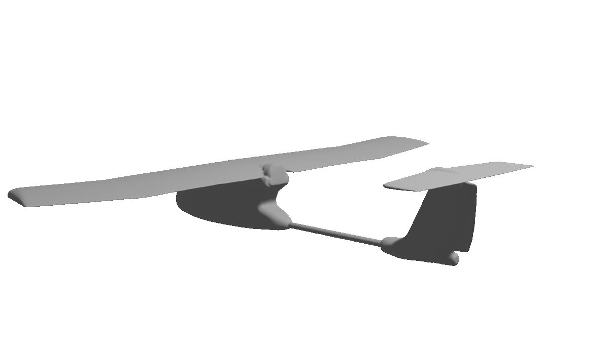

# asl_fixedwing
The Autonomous System Lab's repository for code related to fixedwing aircraft flight. This repository can be used to run code in simulation using Gazebo as well as on board the Skywalker aircraft. Some documentation can be found for the hardware + build + simulation + modeling & control in the docs/ directory or on [Overleaf](https://www.overleaf.com/read/ccyrgryqcnwj) (for edit access to documentation ask Joe Lorenzetti).



# Dependencies
Ubuntu 18.04 + ROS Melodic

MAVROS

Gazebo Simulator

# Setup
Start by cloning this repository into your ROS1 workspace.
```
cd <ros1_ws/src>
git clone https://github.com/StanfordASL/asl_fixedwing.git
```

Now follow the appropriate instructions for setup/install for your use case as outlined in the docs/documentation.pdf file or on [Overleaf](https://www.overleaf.com/read/ccyrgryqcnwj).

## QP Solver
Some components of asl_fixedwing require QP solvers. We use the qpOASES as the QP solver as it is fast and can be run onboard the Odroid companion computer. Note we are using the asl-v3.2.0 branch of qpOASES instead of the asl-v3.2.1 branch due to an unresolved issue with linking against the qpOASES library with v3.2.1.

```
cd ~
git clone https://github.com/jlorenze/qpOASES.git
cd qpOASES
git checkout asl-v3.2.0
mkdir bin
make
```

Then update the CMakeLists.txt file in this repository to make sure it has the line:
```
SET(QPOASES_INCLUDE_DIRS <path-to-install-dir>)
SET(QPOASES_LIBRARIES <path-to-install-dir>/bin/libqpOASES.a
					${LAPACK_LIBRARIES}
					${BLAS_LIBRARIES})
```
Now build the package
```
source <ros1_ws/devel/setup.bash
catkin build asl_fixedwing
```

If you are not using QP solvers and want to avoid this step, just remove any links from the CMakeLists file and don't compile those parts of the repository.
